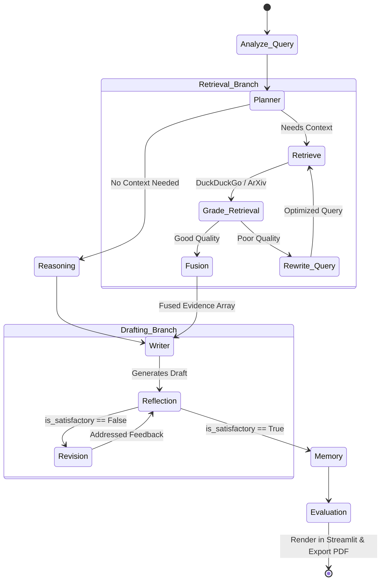

<div align="center">
  <h1>🔬 AutoResearch</h1>
  <p><b>A Self-Reflective Hierarchical Multi-Agent Research Platform</b></p>
  <p>
    
    
    
  </p>
</div>

<br>

AutoResearch is a highly adaptive, multi-agent artificial intelligence platform built on **LangGraph**. It goes beyond simple RAG (Retrieval-Augmented Generation) by simulating a team of specialized AI researchers that dynamically plan, retrieve, critique, revise, and continuously improve their outputs to synthesize professional-grade academic and technical reports.

## ✨ Key Features

- **Hierarchical Agent Orchestration**: A Planner (Supervisor) coordinates specialized Worker Agents (Retrieval, Grading, Fusion, Writer, Reflection, Revision) using an adaptive compute controller.
- **CRAG-Inspired Retrieval Grading**: Implements Corrective Retrieval Augmented Generation (CRAG) to automatically grade the quality of retrieved context. If retrieval fails, the Query Rewrite Agent intelligently reformulates the search.
- **Self-Reflective Revision Loops**: The Reflection Agent acts as a strict Critic Gate, forcing the Revision Agent to fix missing citations, unsupported claims, or hallucinations before finalizing the draft.
- **Dual-Mode Streamlit Dashboard**: 
  - **Research Mode**: Streams the live LangGraph execution and generates a comprehensive Markdown report featuring dynamically generated AI images and State-of-the-Art (SOTA) benchmarks.
  - **Interactive Q&A Mode**: Allows users to chat with a memory-aware agent to ask follow-up questions about the generated report.
- **PDF Export**: One-click compilation of the Markdown report into a formatted PDF.
- **Execution Analytics**: Visually tracks system latency, reflection loops, LLM calls, and retrieval steps.

---

## 🧠 System Architecture

The core of AutoResearch is a cyclic LangGraph state machine that ensures rigorous quality control through iterative reflection and revision.



---

## 🚀 Getting Started

Follow these steps to deploy AutoResearch on your local machine.

### 1. Clone the Repository
```bash
git clone https://github.com/yourusername/AutoResearch.git
cd AutoResearch
```

### 2. Set Up the Virtual Environment
Ensure you have Python 3.10+ installed.
```bash
python -m venv .venv
source .venv/bin/activate  # On Windows use: .venv\Scripts\activate
```

### 3. Install Dependencies
```bash
pip install -r requirements.txt
```

### 4. Configure Environment Variables
Open `configs/.env` and add your API keys (you can use the provided `.env.example` as a template if available).
```env
# Get from https://aistudio.google.com/
GEMINI_API_KEY="your-gemini-key"

# Get from https://console.mistral.ai/
MISTRAL_API_KEY="your-mistral-key"

# (Optional) For LangSmith Tracing
LANGCHAIN_TRACING_V2="true"
LANGCHAIN_API_KEY="your-langchain-key"
LANGCHAIN_PROJECT="AutoResearch_Assistant"
```
*Note: You can also configure the Gemini and Mistral keys directly within the Streamlit UI sidebar.*

### 5. Launch the Application
Run the Streamlit server to access the dashboard.
```bash
streamlit run app.py
```

---

## 🛠️ The Agent Team

- **Planner (Gemini)**: Determines the research intent and allocates the compute budget.
- **Retriever**: Executes multi-source fetching via DuckDuckGo (Web) and ArXiv (Academic).
- **Grader (Gemini)**: Scores the relevance of the fetched documents to prevent context contamination.
- **Fusion Layer**: Normalizes scattered facts into a single structured array of high-confidence claims.
- **Writer (Mistral)**: Drafts the initial report, embedding citations, SOTA benchmarks, and dynamic visual assets via Pollinations.ai.
- **Reviewer / Critic (Gemini)**: Validates the draft against the evidence to catch hallucinations and missing citations.
- **Revisor (Mistral)**: Modifies the draft based strictly on the Reviewer's feedback.

---

## 📈 Evaluation & Observability

AutoResearch uses **LangSmith** for deep trace logging. By enabling `LANGCHAIN_TRACING_V2=true` in your `.env`, you can visualize the exact LLM payloads, token costs, and node transition states directly in the LangChain dashboard. 

The Streamlit UI also provides real-time **Execution Analytics** calculating:
- Total Wall-Clock Latency
- Number of LLM Calls
- Reflection Iterations
- Retrieval Step Counts

---

<div align="center">
  <i>Designed for complex, autonomous scientific and technical synthesis.</i>
</div>
